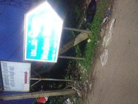
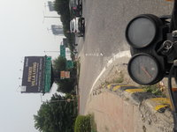
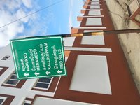
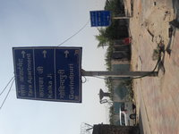
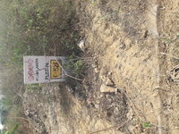
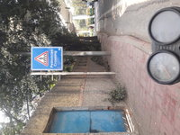
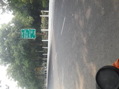
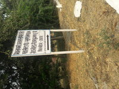
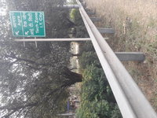
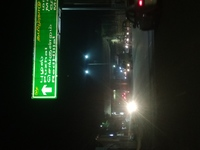

# Indian Signboard Image Dataset   

This dataset consists of images of Indian Signboards captured accross different cities in India.  

**Introduction:**    
The dataset consists of Indian traffic signs images for classification and detection. The images have been taken in varied weather conditions in daylight, evening and nights. The dataset has a wide variety of variations of illumination, distances, view points etc. This dataset represents a very challenging set of unstructured images of Indian traffic signboards.
    

**Dataset Features:**  
* Captured by 2000+ unique users
* Covers wide variety of Indian traffic signs
* Captured with 20+ cities accross India
* Captured using mobile phones    
* Highly diverse 
* Various lighting conditions like day, night,   
* Outdoor scene with variety of view points

**Dataset Format**  
* Classification and detection annotations available  
* Multiple category annotations possible 
* COCO, PASCAL VOC and YOLO formats  
* Approx. 6000 unique images  

**Sample Images**  
          

# Datacluster Labs Datasets

Datacluster Labs focuses on Crowd Data Collection through our managed crowd-sourcing platform - [Dailydata](https://play.google.com/store/apps/details?id=com.daily.data). 

We provide integrated services for your AI needs:  
* Data Collection  
* Data Curation  
* Data Annotation 

We deal with all types of multimedia data collection and annotation like images, videos, audio, text and surveys.

**To download full datasets or to submit a request for your dataset needs, please contact **contact@datacluster.in****  

To download the full datasets, please contact [contact@datacluster.in](contact@datacluster.in).  
Visit [www.datacluster.in](www.datacluster.in) to know more.
    

**Note:**  
**All the images are manually verified and are contributed by the large contributor base on our platform.** 